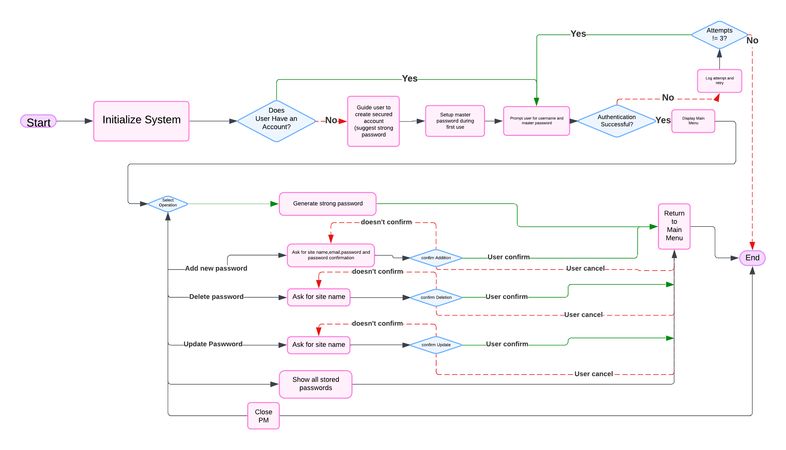
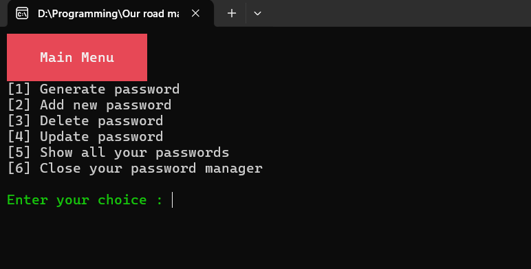
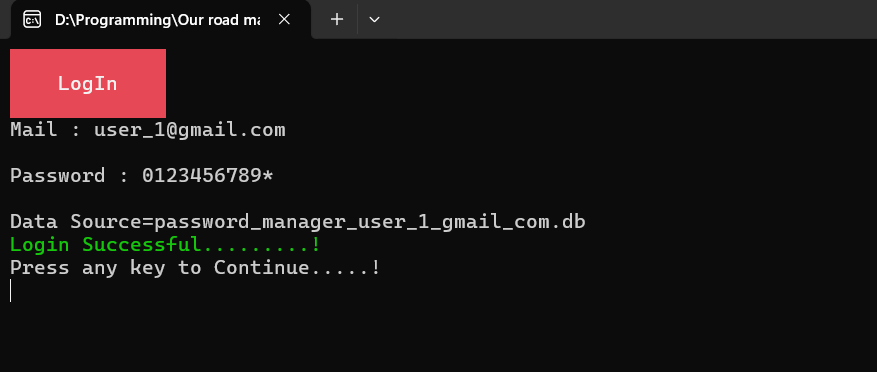
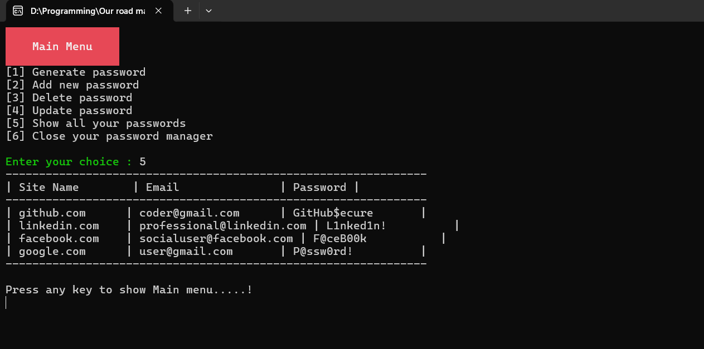
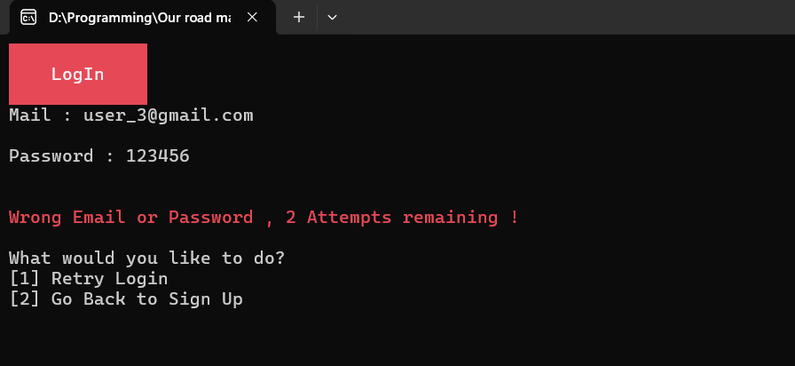
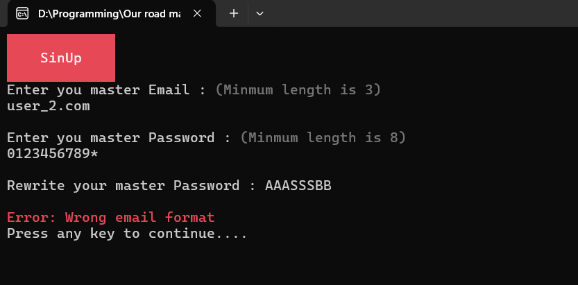
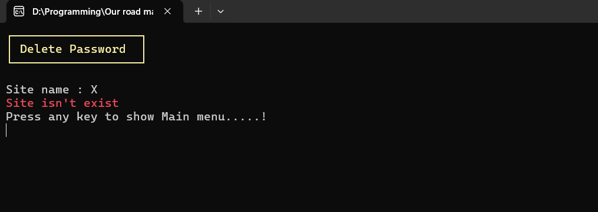
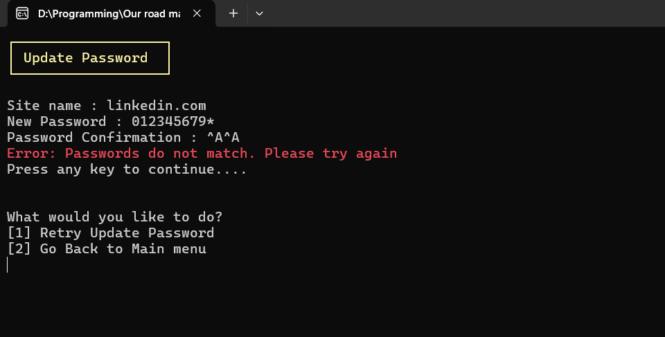

# Password-Manager
A secure console-based password management solution—initially console-only, with planned UI and advanced feature improvements—that stores and encrypts your passwords using robust cryptographic algorithms.
## Project Structure
```plaintext
📦 PasswordManager
├── 📂 Core              # Core application logic
│   ├── IPasswordManager.cs         - Main service interface
│   ├── PasswordManagerService.cs   - Core implementation
│   ├── IEncryptionService.cs       - Encryption contracts
│   ├── XorEncryptionService.cs     - XOR+HMAC implementation
│   ├── IAuthenticationService.cs   - Auth contracts
│   ├── SHA_1AuthenticationService.cs - SHA-1 implementation
├── 📂 Models            # Data models
│   ├── PasswordEntry.cs            - Password entry structure
├── 📂 Database          # Database operations
│   ├── IDatabaseService.cs         - DB contracts
│   ├── SQLiteDatabaseService.cs    - SQLite implementation
├── 📂 UI                # User interface
│   ├── IUserInterface.cs           - UI contracts
│   ├── ConsoleUserInterface.cs     - Console UI implementation
│   ├── ConsoleHelper.cs            - UI utilities
│   ├── IInputValidator.cs          - Validation contracts
│   ├── InputValidator.cs           - Input validation
└── Program.cs          # Entry point
```
## [UML Activity Diagram](https://lucid.app/lucidchart/3bb6d3b4-ce77-4b12-9143-0361bd801a14/edit?viewport_loc=285%2C990%2C1201%2C501%2C0_0&invitationId=inv_86453fbd-9a38-4aa1-8292-8f35504f0705)

## Features 
- User Authentication with `SHA-1 Hashing` 
- `XOR` Encryption with `HMAC-SHA256` 
- Multi-user (separate database per user)
-  Strong Password Generator
-  Robust handling for any unexpected input to ensure reliability and security. 
- Password Entry Management
  - 
  
## Technical Details 
### Authentication 
- Implements `SHA-1` hashing for master passwords to securely safeguard each user credentials in thier setion at the Password Manager.
### Encryption
- Enhance the `XOR cipher` with `HMAC-SHA256` to securely encrypt each password before storing it in the database.
### Database Structure
- Each user has a dedicated SQLite database, named after their email, which is loaded upon successful login. All stored passwords within the database are securely encrypted, ensuring robust privacy and security. 
  - 
  - 

### Handling unexpected input and wrong confirmation
  - 
  - 
  - 
  - 
  

## Installation 

```powershell 
git clone https://github.com/yourusername/PasswordManager.git
cd PasswordManager
dotnet run
```
